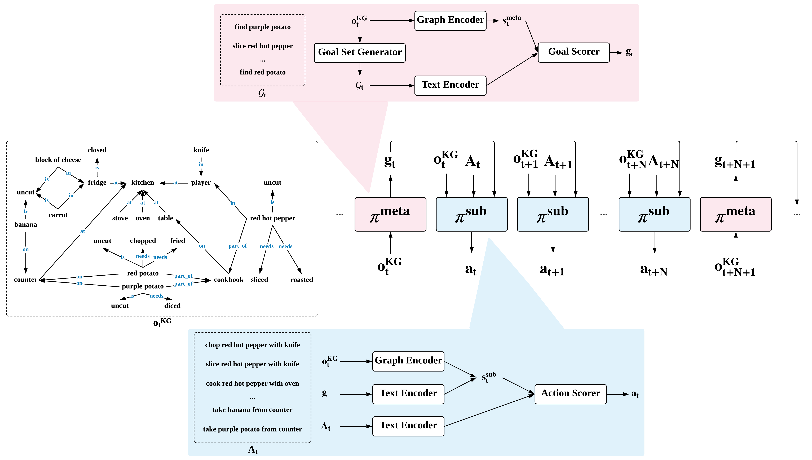

# H-KGA




This repository contains official implementation for our paper: 

Generalization in Text-based Games via Hierarchical Reinforcement Learning

Yunqiu Xu, Meng Fang, Ling Chen, Yali Du and Chengqi Zhang

## Dependencies

Our code depends heavily on [xingdi-eric-yuan/GATA-public](https://github.com/xingdi-eric-yuan/GATA-public) for providing the excellent codebase. Specifically, we use the version [413a262](https://github.com/YunqiuXu/GATA-public). The requirements could be found at [requirements.txt](requirements.txt).

## How to train

+ Download the word embeddings:

```
wget "https://bit.ly/2U3Mde2"
```

+ Download the games: 
    + L3/L7/L5/L9 correspond to S1/S2/S3/S4
    + L1/L2/L4/L8 correspond to US1/US2/US3/US4

```
wget https://aka.ms/twkg/rl.0.1.zip
```

+ Modify the [train_rl_config.yaml](train_rl_config.yaml)
+ Run the code

```
python train_rl.py train_rl_config.yaml
```

## Citation

```
arxiv link
```

## License

[MIT License](LICENSE)
